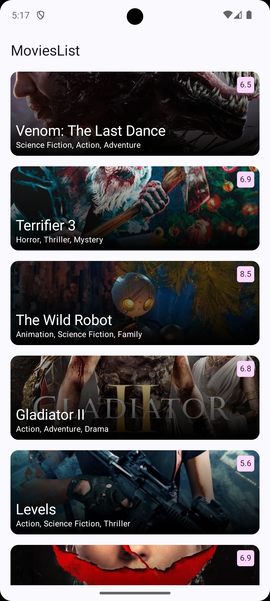
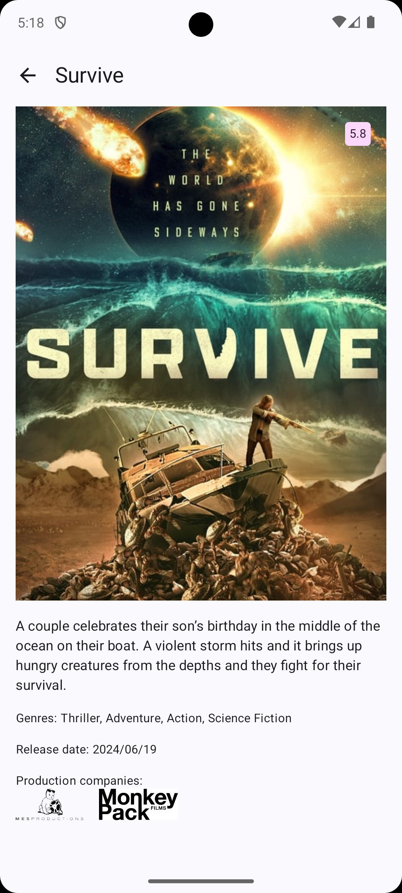

# MoviesList

MoviesList is a sample Kotlin + Jetpack Compose app to display movies that are currently in
theatres.

This sample showcases:

* Jetpack Compose
* UI state management
* Integration with Architecture Components: Navigation, ViewModel
* Clean Architecture
* Hilt
* Unit tests with MockK
* UI tests for Compose

## Code Challenge

Create a mobile app that interacts with the movie DB API based on the following user stories:

- As a User I want to see a list of movies so that I can get some idea on the movies to watch.
- As a User I want to be able to click on a specific movie in the "latest movies"; so that I can see
  additional information about that movie.

## Screenshots

 

## Features

This sample contains two screens: a list of movies and a detail page for movies.

### App scaffolding

Package [`com.vitoksmile.movieslist`][1]

[`AppGraph.kt`][2] configures the navigation routes and actions in the app.

[1]: app/src/main/kotlin/com/vitoksmile/movieslist

[2]: app/src/main/kotlin/com/vitoksmile/movieslist/AppGraph.kt

### Navigation

[`NavigationManager.kt`][3] is an `interface` to handle navigation between routes.

[3]: app/src/main/kotlin/com/vitoksmile/movieslist/navigation/NavigationManager.kt

### Movies list

Package [`com.vitoksmile.movieslist.overview`][4]

Display list of movies.

[4]: app/src/main/kotlin/com/vitoksmile/movieslist/overview

### Movie details

Package [`com.vitoksmile.movieslist.details`][5]

Display details of a movie.

[5]: app/src/main/kotlin/com/vitoksmile/movieslist/details

### Data

Package [`com.vitoksmile.movieslist.data`][6]

Data module provides [`MoviesRepositoryImpl`][7], which is injected into app as [
`MoviesRepository`][8].

[`RemoteDataSource`][9] uses Retrofit and KotlinX Serialization.

[`AuthorizationInterceptor`][10] manages Bearer authorization by injecting token from `BuildConfig`.

[6]: data/src/main/kotlin/com/vitoksmile/movieslist/data

[7]: data/src/main/kotlin/com/vitoksmile/movieslist/data/MoviesRepositoryImpl.kt

[8]: domain/src/main/kotlin/com/vitoksmile/movieslist/domain/MoviesRepository.kt

[9]: data/src/main/kotlin/com/vitoksmile/movieslist/data/source/remote/RemoteDataSource.kt

[10]: data/src/main/kotlin/com/vitoksmile/movieslist/data/source/remote/AuthorizationInterceptor.kt

### Domain

Package [`com.vitoksmile.movieslist.domain`][9]

Domain module contains `MoviesRepository` and use cases.

[9]: domain/src/main/kotlin/com/vitoksmile/movieslist/domain

### UI tests

In [androidTest](app/src/androidTest/kotlin/com/vitoksmile/movieslist) you'll find a suite of UI
tests that showcase check of list and details screens.

### Unit tests

In [data/test](data/src/test/kotlin/com/vitoksmile/movieslist/data/source/remote/RemoteDataSourceTest.kt)
you'll find unit tests to cover `RemoteDataSource`.

In [domain/test](domain/src/test/kotlin/com/vitoksmile/movieslist/domain)
you'll find unit tests to cover `GetMoviesUseCase` and `GetMovieDetailsUseCase`.
